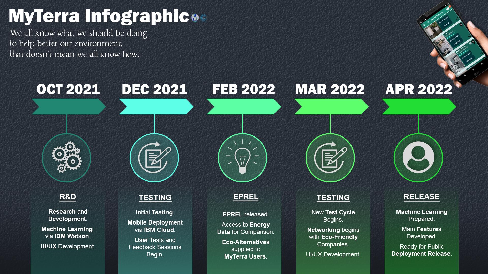
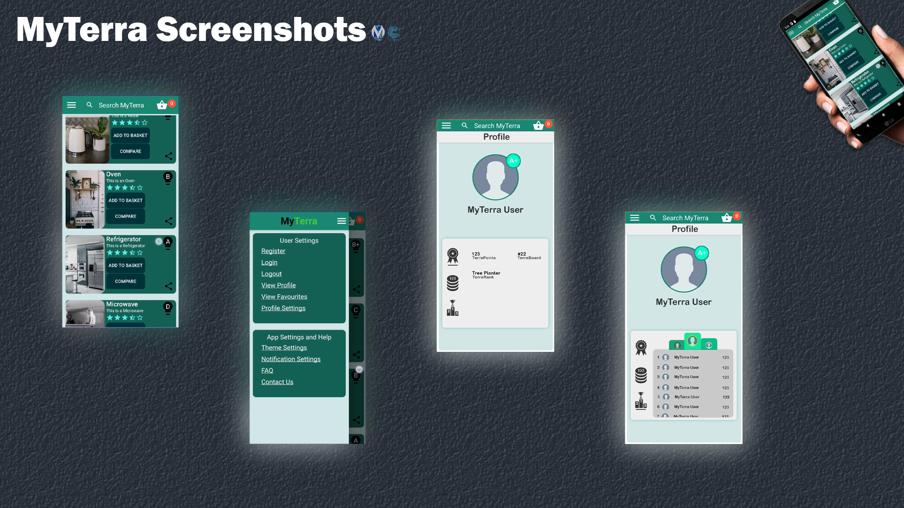

# MyTerra | Official Call for Code Global 2021 Submission

> MyTerra's aim is to make saving our environment an easier and more enjoyable experience.

## Contents

1. [Short Description](#the-short-description)
1. [Long Description](#the-long-description)
1. [Tools Used](#project-tools)
1. [Platform Roadmap](#platform-roadmap-infographic)
1. [Video Demonstration](#visual-demonstration)
1. [Screenshots](#screenshots)
1. [Setup](#application-setup)
    1. [Run on PC Emulator](#android-studio-emulator)
    1. [Installing our APK](#apk)
1. [Contributors](#contributors)

## The Short Description

Encouraging **Eco-Friendly** alternatives, one **Click** at a time.

> We all know what we should be doing to help better our environment, that doesn't mean we all know how.

> [Back to Contents](#contents)

## The Long Description

Click [Here](_docs/LONG_DESCRIPTION.md) for Long Description

> [Back to Contents](#contents)

## Project Tools

* [IBM Cloud](https://www.ibm.com/uk-en/cloud)
* [IBM Watson](https://www.ibm.com/uk-en/watson)
* [IBM CI/CD Pipelines](https://www.ibm.com/garage/method/practices/deliver/tool_delivery_pipeline/)
* [IBM Cloudant](https://www.ibm.com/cloud/cloudant)
* [IBM Object Storage](https://www.ibm.com/uk-en/cloud/object-storage)
* [IBM AppID](https://www.ibm.com/uk-en/cloud/app-id)
* [IBM Db2](https://www.ibm.com/uk-en/analytics/db2)
* [Flutter](https://flutter.dev/) by [Google](https://google.com)
* [EPREL DB](https://ec.europa.eu/info/energy-climate-change-environment/standards-tools-and-labels/products-labelling-rules-and-requirements/energy-label-and-ecodesign/product-database_en)

> [Back to Contents](#contents)

## MyTerra Platform Infographic (Roadmap)

> [Back to Contents](#contents)

## Visual Demonstration

> [Back to Contents](#contents)

## MyTerra Prototype Screenshots

## Application Setup

### Android Studio Emulator

> See [here](https://www.youtube.com/watch?v=hTk2DojxcEM) for running on an Apple machine

* Install [Flutter](https://flutter.dev/docs/get-started/install)
* Install [Android Studio](https://developer.android.com/studio)
* Clone/ Download this Repository
* Open this Repository inside Android Studio
* Start an Android Emulator, see [here](https://docs.expo.io/workflow/android-studio-emulator/) for guidance
* Run the Application, see [here](https://developer.android.com/training/basics/firstapp/running-app) for guidance

### APK

See [here](_docs/prototype/) for prototype .apk file

* Download this .apk to your mobile device
* Locate the .apk in your device's storage
* Install the .apk
* The application will now be on your device

> [Back to Contents](#contents)

## Contributors

* **Alex Duthie** | <a href="https://www.linkedin.com/in/alexduthielnkdn/">Linkedin</a> - <a href="https://github.com/AlexDuthie">GitHub</a >
* **Andrew Ellen** | <a href="https://www.linkedin.com/in/andrew-ellen-3719361b5/">Linkedin</a> - <a href="https://github.com/AndrewEllen">GitHub</a>

> [Back to Contents](#contents)